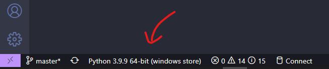
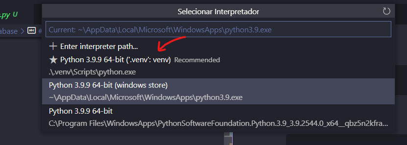

# Exemplo de Querys MQL no Ben10 database

## Como executar?
1. Crie a sua virtual env:
    ```sh
    python -m venv .venv
    ```

2. Ative o virtual env (windows):

* Pelo Terminal
    ```sh
    .\venv\Script\activate.bat
    ```
* Pelo VSCode

    
    <br>
    

3. Instale as dependências:
    ```sh
    pip install -r requirements.txt
    ```
4. execute o arquivo `start.py`
    ```sh
    python start.py
    ```