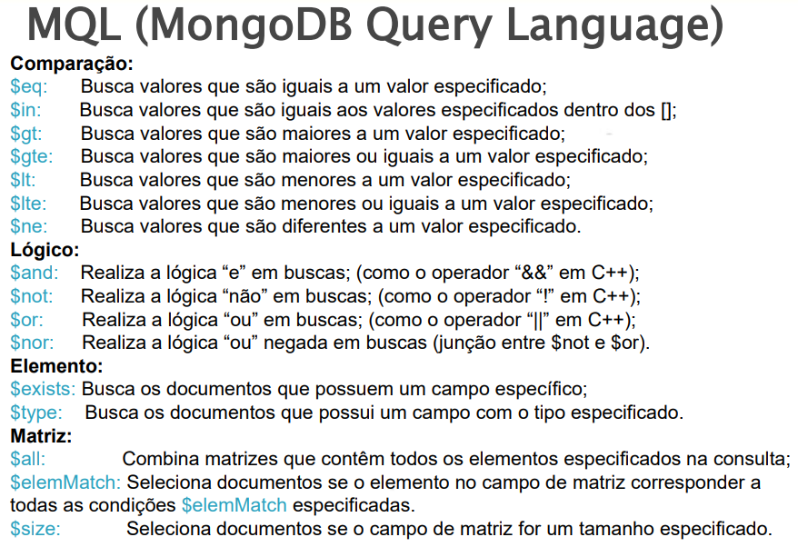

# Taréfas

1. Crie dentro do arquivo <code>src\db\yugioh_db.py</code> uma classe chamada **YuGiOhDB** que tenha uma relação de agregação com a Classe *Database* (YuGiOh contem um Objeto Database).

2. Com **YuGiOhDB** insira as informações do arquivo <code>src\data\yugioh_dataset.py</code> dentro do banco de dados.

3. Crie funções na classe **YuGiOhDB** que retornem:

    a. Todos as Cartas

    b. <code>'*nome*'</code> e <code>'*atk*'</code> das cartas com <code>'*atk*'</code> maior ou igual a 1000 

    c. <code>'*nome*'</code>, <code>'*atk*'</code> e defesa das cartas com <code>'*def*'</code> menor que 400 e <code>'*atk*'</code> maior que 500

4. Utilizando diretamente a função <code>executeQuery()</code> crie 4 pesquisas utilizando as seguintes funções de filtragem, cada pesquisa deve ter pelo menos um 0porador lógico.

    
